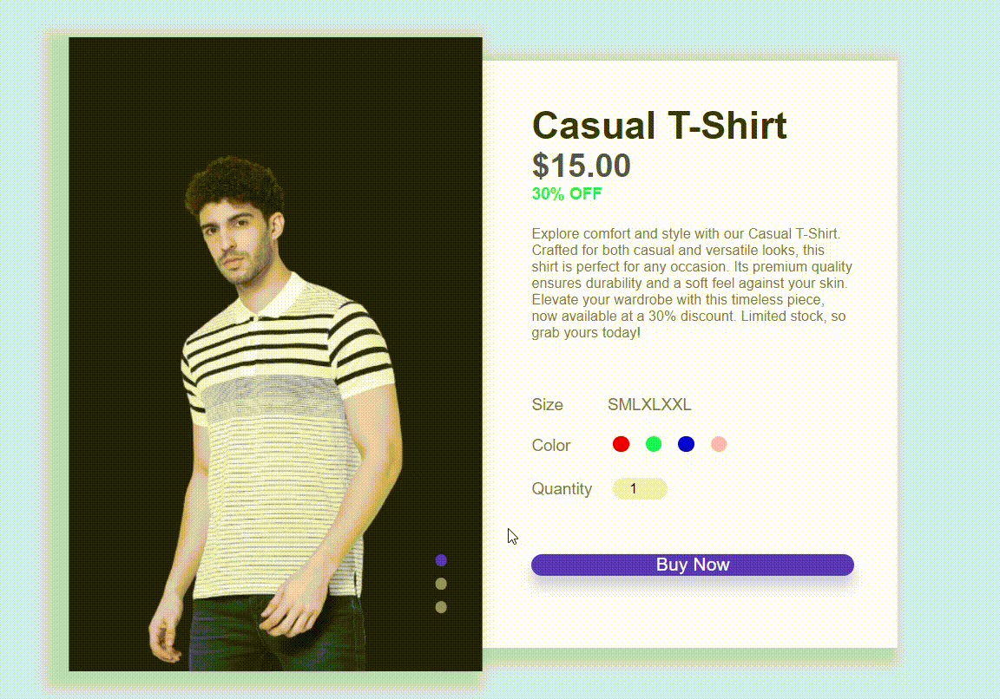

# Product Page Design 🛍️

## Overview
The *Product Page Design* is a modern and stylish layout for showcasing a product with detailed information. It features an image gallery, product details, size and color selection, quantity input, and a "Buy Now" button.

## Technologies Used 🚀
- **HTML**
- **CSS**
- **JavaScript**

## Features 🌟
- Interactive image gallery with thumbnail controls.
- Product details including name, price, and discount information.
- Size selection with radio buttons for Small, Medium, Large, XL, XXL.
- Color selection with radio buttons and corresponding color swatches.
- Quantity input for the desired number of items.
- "Buy Now" button for a quick purchase.

## Usage 💻
1. Click on the thumbnail controls to switch between product images.
2. Review the product details, including name, price, and discount.
3. Select the desired size, color, and quantity.
4. Click the "Buy Now" button to proceed with the purchase.

## Live Demo 🌐
Check out the live demo: [Product Page Demo](#) <!-- Add your live demo link -->

## Installation 🛠️
1. Clone the repository: `git clone https://github.com/Eraycann/Product-Page`
2. Open the project folder in your code editor.
3. Launch the `index.html` file in a web browser.

## Customization 🎨
- Customize the product images in the `img/` directory.
- Adjust the product details and styling in `style.css` to match your product.

## Contributing 🤝
Contributions are welcome! Feel free to enhance the design, add new features, or fix any issues. Open a pull request to contribute.

## License 📜
This project is licensed under the [MIT License](LICENSE.md).

## Author ✨
- Eraycan Sivri
- Contact: eraycansivri@hotmail.com

Enjoy using the Product Page Design!
